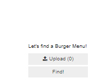
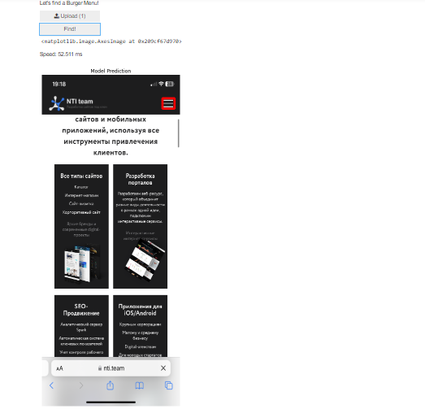

# Buger-Menu-Finder-Model
В данной работе было проведено обучение нейронной сети, способной распознавать бургер-меню на скриншоте мобильной версии произвольного сайта. Архитектура используемой сети: UNet - предоставлена в отдельном python ноутбуке.

Размер обучающей выборки: 520 изображений
Размер валидационной выборки: 100 изображений 
Тип входного изображения: .png
Размер входного изображения: 768x320

Результат работы:

Дополнительно для демонстрации результатов с помощью встроенных python-виджетов был реализован простейший web-интерфейс:

Данный интерфейс позволяет пользователю загрузить скриншот, нажать кнопку “Find!” и увидеть результат распознавания в виде изображения, на котором бургер-меню выделено красной рамкой. 

В комментарии к изображению подписано время, потраченное сервером на распознавание в милисекундах. 

Для финального ручного тестирования использовалось 29 изображений, которые нейросеть ранее не видела. На двух изображениях из 29 были заметны погрешности при детектировании заданного объекта. 

